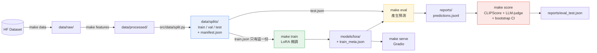

# AstroVision LoRA — 天文影像描述

用 LoRA 微調視覺語言模型，讓它用天文資料集的語彙描述星體與探測器影像，
並且**讓評估數字是可信的**。

預設基礎模型是 **Gemma 3 4B IT**（4-bit 只有 4.25 GiB、unsloth 鏡像不需申請核准）。
換模型是改設定，不是改程式——見[換基礎模型](#換基礎模型)。

## 問題

原始 notebook 流程能跑出 BLEU/ROUGE，但那組數字沒有意義，因為它同時犯了三個錯：

| # | 問題 | 後果 |
|---|---|---|
| 1 | 用**全部**資料訓練，訓練完才切 train/test | 測試集 100% 出現在訓練資料裡，量到的是背書能力 |
| 2 | `tokenizer.decode(out[0])` 把 prompt 一起解碼 | 每筆預測前面都黏著整句 instruction，送進 BLEU 一起算分 |
| 3 | `temperature=1.0` 但沒有 `do_sample=True` | 參數被 transformers 靜默忽略，實際是 greedy，看起來卻像在 sampling |
| 4 | 只用 BLEU/ROUGE 當指標 | 那是字面重疊，量不到事實正確性——把星系名稱全講錯、句型一致的輸出可以拿高分 |

本專案把這三個錯誤在**結構上**修掉，而不是靠註解提醒——切分是唯一入口且先於訓練、
decode 一定去掉 prompt、greedy 模式根本不會攜帶 sampling 參數。詳見
[修了什麼](#修了什麼) 與 `tests/test_no_leakage.py`。

## 成果表

跑 `make eval` 之後由 `reports/eval_test.json` 產生。**尚未執行，數字待填**：

| 指標 | 意義 | Base | LoRA | 人類參考 |
|---|---|---|---|---|
| CLIPScore | 圖文對齊（不看參考句） | — | — | — |
| judge accuracy | 描述是否符合圖片，1–5 | — | — | n/a |
| judge style_match | 是否像訓練語料的句型，1–5 | — | — | n/a |
| judge 幻覺數／張 | 圖片不支持的具體聲稱 | — | — | n/a |
| 無幻覺比例 | 完全沒有幻覺的張數佔比 | — | — | n/a |
| held-out 筆數 | | — | — | |

> **「人類參考」那一欄是重點。** CLIPScore 單看沒有意義——模型拿 0.72 是好是壞，要
> 對照同一批圖片上人類撰寫描述拿到的分數（天花板）才知道。`make eval` 會自動算這一欄。

> held-out 只有二十幾筆，點估計沒有意義，所以每個指標都附 bootstrap 95% 信賴區間。
> 比較 base 與 LoRA 請看**區間有沒有重疊**，不要比小數點。

## Demo

```bash
make serve
```

開 <http://localhost:7860>。介面可以**並排比較微調前後**——兩欄是同一個模型，
「原廠模型」那欄是在 `PeftModel.disable_adapter()` 裡跑的，所以不多吃顯存，
看到的差異就是 LoRA 的效果。標頭永遠標示現在載入的是 base 還是 LoRA，
避免把未微調的輸出誤認成微調結果。

線上 Demo：_尚未部署_（部署方式見下方[部署](#部署)）

## 架構



切分節點在訓練之前，而且是唯一產生 train/val/test 的地方——這條有向邊的方向，
就是「測試集洩漏」寫不出來的原因。

---

## 快速開始

### 在 Colab 上（要 GPU 的步驟都在這裡跑）

開 [`notebooks/colab_train.ipynb`](notebooks/colab_train.ipynb)，執行階段選 **T4 GPU**，
從上往下跑完即可：clone → 安裝 → 資料 → 切分 → 訓練 → 評估 → 上傳權重。

> **Colab 上不要跑 `uv sync`。** Colab 預裝的 torch 已經跟它的 CUDA 對好了，
> 重裝會撞回 transformers / huggingface_hub 版本衝突。notebook 用的是
> `make setup-colab`，刻意不碰 torch。

notebook 的每一步都是獨立子行程（`!python -m ...`），所以某一步失敗時顯存會隨行程結束
自動釋放——不會像單一 notebook 那樣，失敗的模型被 traceback 抓著不放、下一次執行直接 OOM。

### 在自己的機器上

```bash
uv sync --extra dev --extra clip --extra judge --extra serve
```

`clip` 是 CLIPScore（torch + transformers，CPU 也能跑），`judge` 是 LLM-as-judge
（anthropic SDK）。GPU 機器（Colab / 有 CUDA）再加訓練堆疊：

```bash
uv sync --extra dev --extra clip --extra judge --extra serve --extra gpu
```

然後：

```bash
make data       # 下載資料集到 data/raw/
make features   # 清洗 + 驗證 + 切分 -> data/processed/ 與 data/splits/
make train      # LoRA 微調（只讀 train 切分）
make eval       # 在 test 切分上產生預測並評分（CLIPScore + LLM-as-judge）
make score      # 只重算指標，不重新產生預測
make serve      # Gradio
make upload     # 把 models/lora/ 推到 Hugging Face
make space      # 組出 build/space/，準備推到 Hugging Face Space
```

Windows 沒有 `make` 的話，每個 target 就是一行 `uv run python -m ...`，直接看 `Makefile`。

## 下載權重

權重不進版控（`.gitignore` 排除 `data/` 與 `models/`）。要直接用現成的 LoRA：

```bash
make weights OVERRIDE="lora.repo_id=<user>/<adapter-repo>"
```

或把 `lora.repo_id` 寫進 `configs/config.yaml` 之後跑 `make weights`。
權重會落在 `models/lora/`，`make eval` 與 `make serve` 都優先讀這裡，
沒有本機權重才退回 hub 上的 `repo_id`；兩者都沒有時會**明講**現在跑的是 base 模型。

`make train` 訓練完也會寫到同一個目錄，所以自訓與下載的權重是同一條讀取路徑。

## 設定

所有超參數在 `configs/config.yaml`，程式碼裡不硬編碼。CLI 覆寫：

```bash
make train OVERRIDE="train.max_steps=60 lora.r=32 features.clean_mode=aggressive"
```

## 換基礎模型

```bash
make train MODEL=qwen2_vl_2b
```

| 預設 | 授權 | 4-bit 大小 | 說明 |
|---|---|---|---|
| `gemma3_4b`（預設） | Gemma Terms of Use | 4.25 GiB | 最小的多模態選項；T4 上 fp16 數值最敏感，見下方 |
| `qwen2_5_vl_7b` | Apache 2.0 | 6.43 GiB | 品質最好，T4 載完剩約 8 GB 給訓練 |
| `qwen2_vl_2b` | Apache 2.0 | 2.29 GiB | 載入與訓練都最快 |
| `llama3_2_11b_vision` | Llama 3.2 Community | 7.37 GiB | 原專案用的；需顯示 "Built with Llama"，且視覺功能歐盟境內不得使用 |

Gemma 3 用 bf16 訓練、activation 會超過 float16 上限（65504），而 T4 沒有 bf16 硬體。
unsloth 對此有專門處理（activation 走 bf16/fp32、只有 matmul 降到 fp16、layernorm 升到
fp32），所以可以跑，但這是四個預設裡最容易出現 `nan` loss 的。看到 nan：先確認 unsloth
是最新版，再往下調 `train.learning_rate`（預設檔已先調到 1e-4）。

`MODEL=` 對應 `configs/models/<name>.yaml`。**同一次實驗的 `train` / `eval` / `serve`
要用同一個 `MODEL`**，否則 adapter 對不上基礎模型會直接載入失敗。

Qwen2-VL 系列是動態解析度：處理器預設上限 12.8M 像素，一張大圖就能產生上萬個
vision token，在 T4 上必爆。`model.image_max_pixels` 預設夾到 768×768（約 750 個 token），
在 `loader.clamp_image_resolution()` 套用；mllama 是固定 tiling，該設定會自動變成 no-op。

## 指標

預設兩個指標，都不看字面重疊：

### CLIPScore（無參考）

把圖片和生成描述各自編碼進 CLIP 的共用空間，量兩者夾角。**不看參考句子**，所以它問的是
「這段話在描述這張圖嗎」，而不是「這段話跟參考句子有多像」。換句話說改寫不會被罰、換名詞會被罰。

報告會同時給三個數字：

| 欄位 | 意義 |
|---|---|
| `clipscore` | 模型描述 vs 圖片 |
| `clipscore_reference` | **人類描述 vs 圖片 —— 這是天花板** |
| `ref_clipscore` | 上面兩者與「模型 vs 人類文字相似度」的調和平均 |

一定要對照 `clipscore_reference` 讀。另外 CLIP 的文字編碼器硬上限 77 個 token，
報告會列出被截斷的筆數；截斷比例高的話，分數只反映了描述的前半段。

### LLM-as-judge（看得見圖）

把圖片、參考描述、模型輸出一起送給 `claude-opus-5`，用固定 rubric 打分：
`accuracy` / `style_match` / `fluency` / `hallucination_count` / `overall`，外加一句理由。

**這是唯一能量到幻覺的指標。** BLEU 分不出「火星上的探測車」和「月球上的探測車」；
CLIPScore 知道不對但說不出哪裡不對；judge 會直接寫「圖中沒有探測車」。

三個讓數字可用的設計：

- **judge 不知道是誰寫的。** prompt 裡沒有 base／LoRA 標籤，所以它沒辦法偏袒任一邊。
  `tests/test_scoring.py` 有一個測試專門守這件事。
- **rubric 每一級都有錨點。** 沒有錨點的 1–5 分會在樣本之間漂移，跑兩次就不能比。
- **`rubric_version` 寫進報告。** 改了 rubric 就是換了一把尺，報告沒記就不能跟舊的比。

要花錢。25 張圖用 opus-5 大約 **$0.75**。先看預估不實際呼叫：

```bash
make score OVERRIDE="llm_judge.cost_estimate_only=true"
```

需要 `ANTHROPIC_API_KEY`。**它是模型意見，不是 ground truth**，報告裡也這樣寫。

### BLEU / ROUGE

還在，但預設不開。留著是為了跟原始 notebook 和 captioning 文獻對照：

```bash
make eval OVERRIDE="eval.metrics=[clipscore,llm_judge,bleu_rouge]"
```

### 產生與評分是分開的

`make eval` 需要 GPU，`make score` 需要 CLIP 權重和 API key。預測會**先寫進**
`reports/predictions_<split>.jsonl` 才開始算指標，所以：

- judge 失敗（API key 過期、額度用完）不用重跑一次 GPU 生成
- 改了 rubric 可以用同一批輸出重新評分，公平比較
- GPU 機器忙的時候可以在筆電上跑評分

```bash
make score      # 只重算，不重新生成
```

## 修了什麼

| Bug | 原本 | 現在 | 擋住它的東西 |
|---|---|---|---|
| 測試集洩漏 | 先訓練、後切分 | 切分是唯一入口且先於訓練；`load_split(..., for_eval=True)` 拒絕回傳 train | `tests/test_no_leakage.py`（CI 獨立跑一次） |
| prompt 混進預測 | `decode(out[0])` | `strip_prompt(seq, prompt_len)` 只解碼新生成的 token | `tests/test_infer_decode.py` |
| temperature 空轉 | `temperature=1.0` 但 greedy | `build_gen_kwargs()`：greedy 時完全不帶 sampling 參數 | `tests/test_infer_decode.py` |
| 迴圈中途 `pip install` | 推論跑完才裝 evaluate | 依賴全在 `pyproject.toml` | — |
| CUDA 張量堆積 | `raw_outputs.append(out[0])` | `.detach().cpu()` 後才收集 | — |
| 失敗後重跑必 OOM | 直接再跑一次 | `assert_gpu_headroom()` 先擋，並提示重啟 | — |
| transformers 版本衝突 | `transformers==4.56.2` 撞 `huggingface_hub` 1.x 的 `additional_chat_templates` 404 | 釘 `transformers==4.57.3` | `pyproject.toml` 註解 |
| 清洗摧毀專有名詞 | 一律 `[^a-z\s]` 全刪 | `clean_mode` 預設 `conservative`，`aggressive` 保留但標註有損 | `tests/test_features.py` |
| 25 筆報三位小數 | 只報點估計 | 一律附 bootstrap 95% CI 與 `n` | — |
| 指標量不到正確性 | 只有 BLEU/ROUGE | CLIPScore（圖文對齊，附人類天花板）+ LLM-as-judge（看得見圖，會數幻覺） | `tests/test_scoring.py` |
| 評分失敗就得重跑生成 | 生成與評分綁在一起 | 預測先落地成 jsonl，`make score` 可單獨重算 | `tests/test_scoring.py` |

## 專案結構

```
.
├── README.md                問題 / 成果表 / Demo / 架構圖
├── MODEL_CARD.md            用途、限制、已知偏誤、不適用情境
├── Makefile                 setup / data / features / train / eval / serve
├── pyproject.toml           uv 管理依賴（gpu / eval / serve / dev 分組）
├── app.py                   Hugging Face Space 進入點（薄殼，實作在 src/serving/）
├── requirements.txt         Spaces 專用（Spaces 不讀 pyproject.toml）
├── configs/                 唯一的超參數來源
│   └── models/              基礎模型預設（Gemma / Qwen / Llama）
├── deploy/space/README.md   Space 用的 README，含 HF frontmatter
├── src/
│   ├── config.py            YAML 載入與 CLI 覆寫
│   ├── data/                下載、驗證、建置、切分
│   ├── features/            清洗與對話格式（純函式）
│   ├── models/              載入、訓練、推論、評估、評分、權重上下載
│   │                        clip_score / llm_judge / text_metrics / score
│   └── serving/             Gradio
├── tests/                   含 test_no_leakage.py
├── notebooks/               colab_train.ipynb（完整流程）+ 01_eda.ipynb（EDA）
├── reports/figures/         所有圖表
└── .github/workflows/ci.yml lint + pytest（CPU-only）
```

> `src/` 直接作為 import 根，所以是 `from src.data.split import ...`。
> 這是為了讓目錄結構跟規格的架構圖一比一對應。

## 部署

### 選項 A：Colab 臨時公開連結（免費，最快）

Colab 上跑：

```bash
make serve OVERRIDE="serving.share=true"
```

會拿到一個 `*.gradio.live` 連結，72 小時內有效。上課 demo 用這個最省事。

### 選項 B：Hugging Face Space（長期）

先把 adapter 上傳（Space 讀不到你本機或 Colab 上的 `models/lora/`）：

```bash
make upload OVERRIDE="upload.repo_id=<user>/<adapter-repo>"
```

再組出 Space 檔案並直接推上去：

```bash
make space-push OVERRIDE="space.repo_id=<user>/<space-name>"
```

`make space`（不加 `-push`）只組到 `build/space/`，讓你自己 git push。
在 Colab 上用 `space-push`——不用把檔案抓回本機再推。

推完還有**兩件事只能在 Space 網頁上做**：Settings → Hardware 選 T4 small 以上，
Settings → Variables 加 `LORA_REPO_ID`。

**硬體：免費的 CPU basic 跑不動 11B 模型**，一定要換成 T4 small 或更好。
ZeroGPU 可行但需要 PRO，而且每次呼叫都要重新把 8 GB 權重搬上 GPU。
Space 建好後到 Settings → Variables 加 `LORA_REPO_ID`，沒設的話介面會標示現在跑的是 base 模型。

## 測試

```bash
make test
```

CI 不裝 GPU 堆疊，所有測試都用合成資料在 CPU 上跑，不下載模型、不連網。

## 授權與出處

預設基礎模型 `Gemma 3 4B IT` 使用受 Google Gemma Terms of Use 與 Prohibited Use
Policy 約束，再散布時必須一併傳遞這些使用限制。切到 `qwen2_5_vl_7b` 是 Apache 2.0；
切到 `llama3_2_11b_vision` 則沿用 Llama 3.2 Community License，公開散布時必須顯示
"Built with Llama"，且其視覺功能在歐盟境內不得使用。
資料集出自 [`AIOmarRehan/space-multimodal-dataset`](https://huggingface.co/datasets/AIOmarRehan/space-multimodal-dataset)。
流程參考 [Unsloth_Llama_3.2_11B_Vision_Instruct_Astronomy](https://github.com/AIOmarRehan)。
