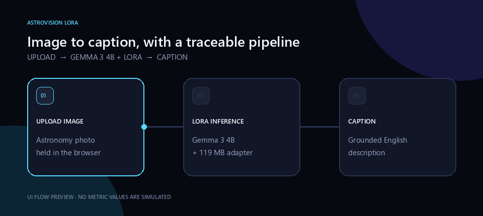
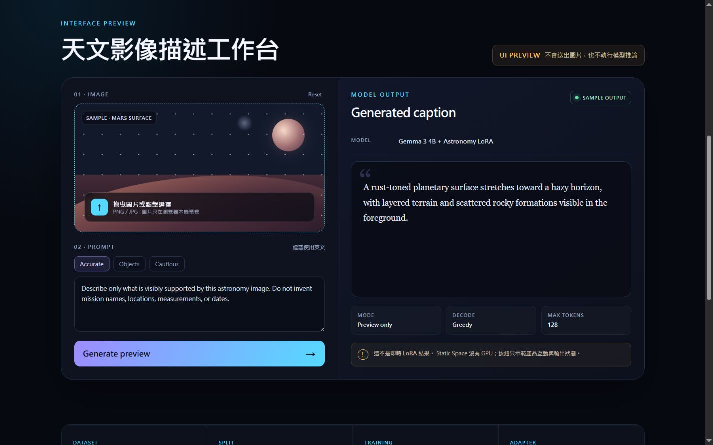
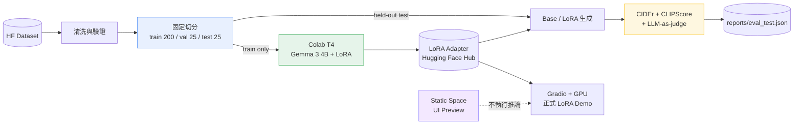

# AstroVision LoRA — 可重現的天文影像描述微調

以 **Gemma 3 4B IT** 為基礎，使用 LoRA（Low-Rank Adaptation，低秩適應）在 250 筆
天文影像資料上微調，並把資料切分、T4 訓練、held-out 評估與部署整理成可重現的工程流程。

[](https://www.python.org/)
[](https://huggingface.co/lee851104/gemma3-4b-astronomy-lora)
[](LICENSE)

[LoRA 權重](https://huggingface.co/lee851104/gemma3-4b-astronomy-lora) ·
[Static UI Preview](https://huggingface.co/spaces/lee851104/astrovision-lora) ·
[Colab Notebook](notebooks/colab_train.ipynb) ·
[Model Card](MODEL_CARD.md)

> 目前 Hugging Face Space 是不執行模型的 UI Preview。真正的 LoRA 推論需要 GPU；介面不會把
> 模擬文字標示成模型結果。CIDEr、CLIPScore 與 LLM-as-judge 的正式 test 數字仍待完成。

## 1. 解決什麼問題

原始 notebook 雖然能訓練並算出 BLEU／ROUGE，但評估流程有四個會讓數字失真的問題：

| 問題 | 原始做法 | 本專案的處理 |
|---|---|---|
| 測試集洩漏 | 先用全部資料訓練，之後才切 train/test | 先產生唯一的 train/val/test manifest；訓練程式只允許讀 train |
| Prompt 混入預測 | 直接解碼完整序列 | 只解碼模型新增的 token |
| Sampling 參數無效 | 設定 `temperature`，卻沒有開 `do_sample` | greedy 模式完全不傳 sampling 參數 |
| 指標回答錯問題 | 只看 BLEU／ROUGE 字面重疊 | 加入 CIDEr、CLIPScore 與看得見圖片的 LLM-as-judge |

目標不是只讓 LoRA「跑完」，而是讓每個結果都能回答：用了哪份資料、哪個切分、哪組權重，
以及 Base 與 LoRA 是否在同一批 held-out 圖片上公平比較。

## 2. 簡易動畫



動畫呈現使用流程：上傳天文影像、送入 Gemma 3 4B + LoRA、取得英文描述。這是介面流程示意，
不是預先偽造的模型評估結果。可在
[Hugging Face Static Space](https://huggingface.co/spaces/lee851104/astrovision-lora) 操作 UI Preview。



## 3. 使用哪些技術？為什麼？

| 技術 | 用途 | 選擇原因 |
|---|---|---|
| Gemma 3 4B IT | 視覺語言基礎模型 | 4B 規模可在 Colab T4 以 4-bit 形式微調，且具備圖片輸入能力 |
| LoRA / PEFT | 參數高效微調 | 只訓練約 0.69% 參數；本次 adapter 約 119 MB，容易保存與部署 |
| Unsloth | T4 訓練最佳化 | 降低顯存需求並提供 Gemma 3 的快速微調支援 |
| Hugging Face Datasets / Hub | 資料與權重版本管理 | 資料來源、adapter 與 Model Card 都能公開追蹤 |
| OmegaConf | 集中管理設定 | 模型、LoRA、訓練與評估參數不散落在程式碼中 |
| CIDEr | Reference-aware caption 指標 | 衡量生成描述與人工參考句的 n-gram 共識 |
| CLIPScore | 圖文對齊指標 | 不依賴字面相同，直接衡量圖片與描述是否匹配 |
| LLM-as-judge | 正確性與幻覺檢查 | 依固定 rubric 評分 accuracy、style、fluency 與 hallucination |
| Gradio | GPU 互動介面 | 後續可在 Hugging Face ZeroGPU 載入 Gemma + LoRA |
| HTML / CSS / JavaScript | 免費 Static Space | 在沒有 GPU 前先展示產品介面、工程紀錄與權重連結 |

## 4. 架構



切分是所有訓練與評估的上游單一來源。`train.py` 不會打開 val/test；`evaluate.py` 也拒絕
使用 train，讓資料洩漏在結構上更難發生。

## 5. 工程亮點

### 可追溯的實際訓練紀錄

| 項目 | 本次結果 |
|---|---:|
| 原始／處理後資料 | 250 / 250 |
| train / val / test | 200 / 25 / 25 |
| 基礎模型 | `unsloth/gemma-3-4b-it-unsloth-bnb-4bit` |
| GPU | Tesla T4 14.6 GB |
| 訓練步數 | 30（約 1.2 epoch） |
| 可訓練參數 | 29,802,496 / 4,329,881,968（0.69%） |
| 訓練時間／峰值 VRAM | 381.5 秒 / 6.836 GB |
| 平均／最後 training loss | 2.8504 / 0.8506 |

Training loss 只表示最佳化有進行，不能取代 test 評估，因此成果表不預填假數字：

| Held-out 指標 | Base | LoRA | 人類參考 |
|---|---:|---:|---:|
| CIDEr | 待評估 | 待評估 | — |
| CLIPScore | 待評估 | 待評估 | 待評估 |
| Judge accuracy / 5 | 待評估 | 待評估 | — |
| Judge hallucination-free rate | 待評估 | 待評估 | — |

### 其他工程設計

- **T4 安全路徑**：偵測 GPU 是否原生支援 BF16；T4 使用原生 gradient checkpointing、
  FP32 LayerNorm，並凍結視覺 LoRA，避免 Gemma 3 dtype mismatch。
- **Base／LoRA 公平比較**：同一個模型透過 `disable_adapter()` 切換，避免兩份模型設定漂移。
- **生成與評分分離**：預測先保存成 JSONL；API 評分失敗時不用重新占用 GPU 生成。
- **小樣本不報假精度**：指標附 bootstrap 95% 信賴區間與樣本數。
- **設定與模型預設分離**：Gemma、Qwen2-VL、Llama 3.2 都由 YAML preset 切換。
- **Secret 不進版控**：`.env`、Hugging Face Token 與 NVIDIA API Key 都由平台環境變數注入。
- **CPU-only CI**：單元測試不下載模型、不連網，也能守住切分、解碼、設定與部署規則。

## 6. 快速開始

### 最短路徑：Google Colab T4

開啟 [`notebooks/colab_train.ipynb`](notebooks/colab_train.ipynb)，把執行階段設為 **T4 GPU**，
由上往下執行：安裝 → 資料 → 切分 → 訓練 → 評估 → 上傳 adapter。

> Colab 不要執行 `uv sync`；notebook 的 `make setup-colab` 會保留 Colab 已配好的 CUDA / PyTorch。

### 本機安裝與測試

```bash
git clone https://github.com/lee851104/lora_mars.git
cd lora_mars
uv sync --extra dev --extra eval --extra clip --extra judge --extra serve
make test
```

### GPU 訓練與評估

```bash
make data
make features
make train
make eval        # LoRA：CIDEr + CLIPScore + LLM-as-judge
make eval-base   # 同一個 test split 的 Base 對照
make upload      # 上傳 models/lora/
```

Windows 沒有 `make` 時，可直接查看 `Makefile` 對應的 `uv run python -m ...` 指令。

### 介面

```bash
make serve              # 有 GPU：Gemma 3 + LoRA Gradio
make space-static       # 無 GPU：產生 Static Space UI Preview
make serve-nvidia       # 暫時的 NVIDIA API 基礎模型展示，不是本專案 LoRA
```

下載已發布 adapter：

```bash
make weights OVERRIDE="lora.repo_id=lee851104/gemma3-4b-astronomy-lora"
```

## 7. 深入閱讀

| 文件／程式 | 內容 |
|---|---|
| [`MODEL_CARD.md`](MODEL_CARD.md) | 模型用途、限制、已知偏誤、訓練紀錄與不適用情境 |
| [`configs/config.yaml`](configs/config.yaml) | 資料、LoRA、訓練、評估與部署的唯一主要設定來源 |
| [`configs/models/README.md`](configs/models/README.md) | Gemma、Qwen2-VL、Llama 3.2 preset 與顯存比較 |
| [`src/models/train.py`](src/models/train.py) | Unsloth 訓練與 T4 BF16 安全處理 |
| [`src/models/evaluate.py`](src/models/evaluate.py) | held-out 生成流程與 Base／LoRA 輸出隔離 |
| [`src/models/score.py`](src/models/score.py) | CIDEr、CLIPScore、LLM-as-judge 報告整合 |
| [`reports/README.md`](reports/README.md) | 預測與評估報告檔案格式 |
| [`deploy/static-space/`](deploy/static-space/) | 免費 Static Space 的 UI Preview |
| [`deploy/render/README.md`](deploy/render/README.md) | Render + NVIDIA API 的暫時互動展示方案 |

核心目錄：

```text
configs/      模型與實驗設定
data/         原始、處理後資料與固定切分（不進 Git）
notebooks/    Colab 訓練／評估入口
src/data/     下載、清洗、驗證、切分
src/models/   訓練、推論、評估、指標、權重上下載
src/serving/  Gradio、Static Space builder、NVIDIA API demo
tests/        CPU-only 防回歸測試
reports/      評估摘要與圖表
```

## 8. 授權

- 本 repository 的程式碼採 [MIT License](LICENSE)。
- `Gemma 3 4B IT` 與其衍生 adapter 仍受
  [Google Gemma Terms of Use](https://ai.google.dev/gemma/terms) 與
  [Prohibited Use Policy](https://ai.google.dev/gemma/prohibited_use_policy) 約束。
- 資料集來自
  [`AIOmarRehan/space-multimodal-dataset`](https://huggingface.co/datasets/AIOmarRehan/space-multimodal-dataset)，
  使用時仍需遵守其資料授權與來源條款。
- 流程參考
  [`AIOmarRehan/Unsloth_Llama_3.2_11B_Vision_Instruct_Astronomy`](https://github.com/AIOmarRehan)。

模型輸出僅供教學與作品集展示，不能作為天文辨識、研究或其他科學判讀依據。
