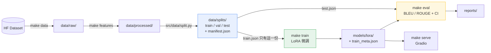

# AstroVision LoRA — 天文影像描述

用 LoRA 微調 Llama-3.2-11B-Vision，讓模型用天文資料集的語彙描述星體與探測器影像，
並且**讓評估數字是可信的**。

## 問題

原始 notebook 流程能跑出 BLEU/ROUGE，但那組數字沒有意義，因為它同時犯了三個錯：

| # | 問題 | 後果 |
|---|---|---|
| 1 | 用**全部**資料訓練，訓練完才切 train/test | 測試集 100% 出現在訓練資料裡，量到的是背書能力 |
| 2 | `tokenizer.decode(out[0])` 把 prompt 一起解碼 | 每筆預測前面都黏著整句 instruction，送進 BLEU 一起算分 |
| 3 | `temperature=1.0` 但沒有 `do_sample=True` | 參數被 transformers 靜默忽略，實際是 greedy，看起來卻像在 sampling |

本專案把這三個錯誤在**結構上**修掉，而不是靠註解提醒——切分是唯一入口且先於訓練、
decode 一定去掉 prompt、greedy 模式根本不會攜帶 sampling 參數。詳見
[修了什麼](#修了什麼) 與 `tests/test_no_leakage.py`。

## 成果表

跑 `make eval` 之後由 `reports/eval_test.json` 產生。**尚未執行，數字待填**：

| 指標 | Base（未微調） | LoRA 微調後 | 95% CI |
|---|---|---|---|
| BLEU | — | — | — |
| ROUGE-1 | — | — | — |
| ROUGE-2 | — | — | — |
| ROUGE-L | — | — | — |
| held-out 筆數 | — | — | |

> 這個資料集切完 held-out 只有二十幾筆，點估計沒有意義，所以評估一律附
> bootstrap 95% 信賴區間。要比較 base 與 LoRA 請看區間有沒有重疊，不要比小數點。

## Demo

```bash
make serve
```

開 <http://localhost:7860>。介面可以**並排比較微調前後**——兩欄是同一個模型，
「原廠模型」那欄是在 `PeftModel.disable_adapter()` 裡跑的，所以不多吃顯存，
看到的差異就是 LoRA 的效果。標頭永遠標示現在載入的是 base 還是 LoRA，
避免把未微調的輸出誤認成微調結果。

線上 Demo：_尚未部署_（部署方式見下方[部署](#部署)）

## 架構



切分節點在訓練之前，而且是唯一產生 train/val/test 的地方——這條有向邊的方向，
就是「測試集洩漏」寫不出來的原因。

---

## 快速開始

```bash
uv sync --extra dev --extra eval --extra serve
```

GPU 機器（Colab / 有 CUDA）再加訓練堆疊：

```bash
uv sync --extra dev --extra eval --extra serve --extra gpu
```

然後：

```bash
make data       # 下載資料集到 data/raw/
make features   # 清洗 + 驗證 + 切分 -> data/processed/ 與 data/splits/
make train      # LoRA 微調（只讀 train 切分）
make eval       # 在 test 切分上算 BLEU/ROUGE + bootstrap CI
make serve      # Gradio
make upload     # 把 models/lora/ 推到 Hugging Face
make space      # 組出 build/space/，準備推到 Hugging Face Space
```

Windows 沒有 `make` 的話，每個 target 就是一行 `uv run python -m ...`，直接看 `Makefile`。

## 下載權重

權重不進版控（`.gitignore` 排除 `data/` 與 `models/`）。要直接用現成的 LoRA：

```bash
make weights OVERRIDE="lora.repo_id=<user>/<adapter-repo>"
```

或把 `lora.repo_id` 寫進 `configs/config.yaml` 之後跑 `make weights`。
權重會落在 `models/lora/`，`make eval` 與 `make serve` 都優先讀這裡，
沒有本機權重才退回 hub 上的 `repo_id`；兩者都沒有時會**明講**現在跑的是 base 模型。

`make train` 訓練完也會寫到同一個目錄，所以自訓與下載的權重是同一條讀取路徑。

## 設定

所有超參數在 `configs/config.yaml`，程式碼裡不硬編碼。CLI 覆寫：

```bash
make train OVERRIDE="train.max_steps=60 lora.r=32 features.clean_mode=aggressive"
```

## 修了什麼

| Bug | 原本 | 現在 | 擋住它的東西 |
|---|---|---|---|
| 測試集洩漏 | 先訓練、後切分 | 切分是唯一入口且先於訓練；`load_split(..., for_eval=True)` 拒絕回傳 train | `tests/test_no_leakage.py`（CI 獨立跑一次） |
| prompt 混進預測 | `decode(out[0])` | `strip_prompt(seq, prompt_len)` 只解碼新生成的 token | `tests/test_infer_decode.py` |
| temperature 空轉 | `temperature=1.0` 但 greedy | `build_gen_kwargs()`：greedy 時完全不帶 sampling 參數 | `tests/test_infer_decode.py` |
| 迴圈中途 `pip install` | 推論跑完才裝 evaluate | 依賴全在 `pyproject.toml` | — |
| CUDA 張量堆積 | `raw_outputs.append(out[0])` | `.detach().cpu()` 後才收集 | — |
| 失敗後重跑必 OOM | 直接再跑一次 | `assert_gpu_headroom()` 先擋，並提示重啟 | — |
| transformers 版本衝突 | `transformers==4.56.2` 撞 `huggingface_hub` 1.x 的 `additional_chat_templates` 404 | 釘 `transformers==4.57.3` | `pyproject.toml` 註解 |
| 清洗摧毀專有名詞 | 一律 `[^a-z\s]` 全刪 | `clean_mode` 預設 `conservative`，`aggressive` 保留但標註有損 | `tests/test_features.py` |
| 25 筆報三位小數 | 只報點估計 | 一律附 bootstrap 95% CI 與 `n` | — |

## 專案結構

```
.
├── README.md                問題 / 成果表 / Demo / 架構圖
├── MODEL_CARD.md            用途、限制、已知偏誤、不適用情境
├── Makefile                 setup / data / features / train / eval / serve
├── pyproject.toml           uv 管理依賴（gpu / eval / serve / dev 分組）
├── app.py                   Hugging Face Space 進入點（薄殼，實作在 src/serving/）
├── requirements.txt         Spaces 專用（Spaces 不讀 pyproject.toml）
├── configs/                 唯一的超參數來源
├── deploy/space/README.md   Space 用的 README，含 HF frontmatter
├── src/
│   ├── config.py            YAML 載入與 CLI 覆寫
│   ├── data/                下載、驗證、建置、切分
│   ├── features/            清洗與對話格式（純函式）
│   ├── models/              載入、訓練、推論、評估、權重下載
│   └── serving/             Gradio
├── tests/                   含 test_no_leakage.py
├── notebooks/               EDA 專用，不放訓練邏輯
├── reports/figures/         所有圖表
└── .github/workflows/ci.yml lint + pytest（CPU-only）
```

> `src/` 直接作為 import 根，所以是 `from src.data.split import ...`。
> 這是為了讓目錄結構跟規格的架構圖一比一對應。

## 部署

### 選項 A：Colab 臨時公開連結（免費，最快）

Colab 上跑：

```bash
make serve OVERRIDE="serving.share=true"
```

會拿到一個 `*.gradio.live` 連結，72 小時內有效。上課 demo 用這個最省事。

### 選項 B：Hugging Face Space（長期）

先把 adapter 上傳（Space 讀不到你本機的 `models/lora/`）：

```bash
make upload OVERRIDE="upload.repo_id=<user>/<adapter-repo>"
```

再組出 Space 檔案並照著印出來的指示推上去：

```bash
make space
```

**硬體：免費的 CPU basic 跑不動 11B 模型**，一定要換成 T4 small 或更好。
ZeroGPU 可行但需要 PRO，而且每次呼叫都要重新把 8 GB 權重搬上 GPU。
Space 建好後到 Settings → Variables 加 `LORA_REPO_ID`，沒設的話介面會標示現在跑的是 base 模型。

## 測試

```bash
make test
```

CI 不裝 GPU 堆疊，所有測試都用合成資料在 CPU 上跑，不下載模型、不連網。

## 授權與出處

基礎模型 `unsloth/Llama-3.2-11B-Vision-Instruct` 沿用 Llama 3.2 Community License。
資料集出自 [`AIOmarRehan/space-multimodal-dataset`](https://huggingface.co/datasets/AIOmarRehan/space-multimodal-dataset)。
流程參考 [Unsloth_Llama_3.2_11B_Vision_Instruct_Astronomy](https://github.com/AIOmarRehan)。
